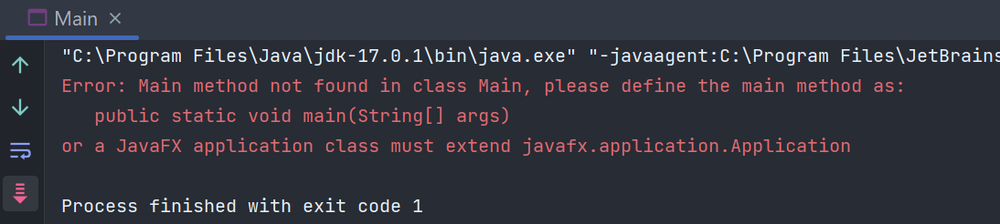
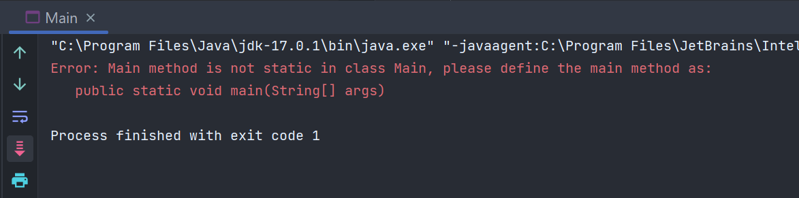
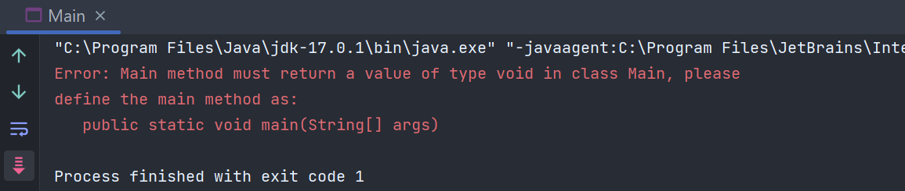

# Phương thức main trong Java  

Phương thức `main` trong hầu hết các ngôn ngữ lập trình có lẽ là hàm đầu tiên mà chúng ta làm quen khi học một ngôn ngữ lập trình mới.     

## Phương thức `main` trong Java
Trong Java cũng vậy, phương thức `main` chính là điểm vào (entry point) khi thực hiện xử lý trong Java, nói cách khác phương thức `main` chính là điểm thực thi của một chương trình. Đồng thời, khi phương thức `main` kết thúc cũng là lúc chương trình kết thúc. Các phương thức khác nếu muốn được thực thi thì chúng phải được gọi trong phương thức `main`

## Cú pháp của phương thức `main`  

```java
public class Main {
    public static void main(String[] args) {
        System.out.println("Hello world!");
    }
}
```

Ý nghĩa các từ khoá trong phương thức `main`:  
- `public`: Đây là phạm vi truy cập, ta bắt buộc phải để quyền truy cập ở dạng `public` để JVM ở bên ngoài có thể truy cập được phương thức và tiến hành thực thi. Nếu sử dụng một phạm vi truy cập khác thì JVM không thể chạy chương trình.  

  

  
- `static`: Khi chương trình bắt đầu, chưa có đối tượng nào được khởi tạo, vì vậy ta cần để phương thức ở dạng `static` để JVM có thể load class vào bộ nhớ và có thể gọi phương thức. Trong trường hợp không có `static` thì sẽ báo lỗi như sau:    

  

- `void`: Đơn giản là vì phương thức `main` không trả về giá trị nào nên để là `void` thôi. Nếu đổi sang kiểu dữ liệu khác cũng sẽ lỗi.       

  

- `String[] args`: Tham số truyền vào mà một mảng String. `args` viết tắt của từ arguments. Ta có thể đổi tên cho tham số mà không nhất thiết dùng `args`. Ngoài ra thay vì dùng mảng String thì ta cũng có thể sử dụng `String...args`. Ví dụ:  
```java
public static void main(String... eri)
```

*Lưu ý*: 
- Nếu tên phương thức mà ta đổi sang một tên khác `main`thì JVM cũng sẽ không tìm được phương thức `main` để chạy chương trình. 
- Trong trường hợp xuất hiện phương thức khác trùng tên với phương thức `main`, thì phương thức nào có tham số thoả mãn điều kiện thì sẽ được chọn làm phương thức `main` của chương trình 
- Bạn có thể sử dụng `throws` để khai báo ngoại lệ 
```java
public static void main(String[] args) throws Exception
```

