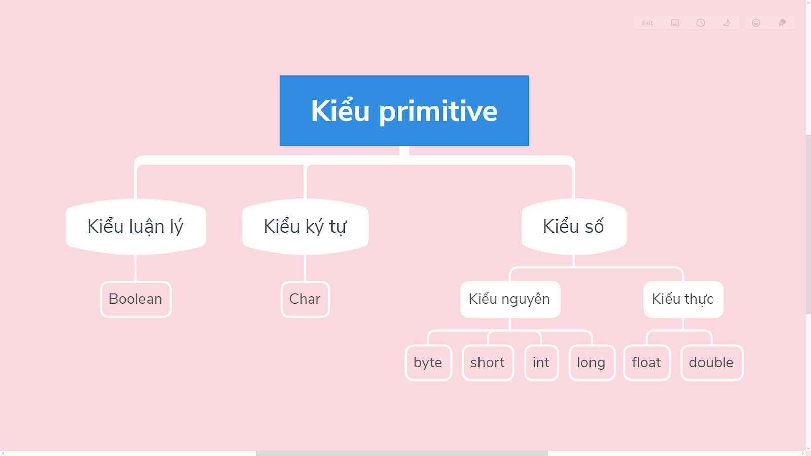

Kiểu dữ liệu trong Java được chia thành hai loại:  
- Các kiểu dữ liệu nguyên thuỷ (Primitive Types)
- Các kiểu dữ liệu tham chiếu (References types)

## Các kiểu dữ liệu nguyên thuỷ  

  
Trong java, có 8 kiểu dữ liệu nguyên thuỷ, đó là: `boolean`, `char`, `byte`, `short`, `int`, `long`, `float`, `double`.    

### Các kiểu số nguyên  
Java cung cấp 4 kiểu số nguyên khác nhau là `byte`, `short`, `int`, `long`  

| Kiểu dữ liệu | Miền giá trị | Giá trị mặc định | Kích cỡ mặc định |
| --- | --- | --- | --- |
| byte | -128 đến 127 | 0 | 1 byte |
| short | -32768 đến 32767 | 0 | 2 byte |
| int | $-2^{31}$ đến $2^{31}-1$ | 0 | 4 byte |
| long | $-2^{63}$ đến $2^{63}-1$ | 0L | 8 byte |  

Ví dụ:  
```java
int age = 18;
long salary = 30000000L;
```

### Các kiểu số thực  
Đối với số thực, java hỗ trợ hai kiểu dữ liệu là `float` và `double`. Kiểu số thực không có giá trị nhỏ nhất cũng như là giá trị lớn nhất  

| Kiểu dữ liệu | Giá trị mặc định | Kích cỡ mặc định |
| --- | --- | --- |
| float | 0.0f | 4 byte |
| double | 0.0d | 8 byte |  

Ví dụ:
```java
float weight = 40f;
double height = 1.6; 
```

***Lưu ý***: Đối với kiểu `float` bắt buộc phải có vĩ ngữ `f` đằng sau giá trị. Tuy nhiên, với kiểu `double` là kiểu mặc định cho kiểu số thực, nên có thể bỏ qua vĩ ngữ `d`  

### Kiểu ký tự  
Kiểu ký tự trong Java có kích thước là 2 byte và chỉ dùng để biếu diễn các ký tự trong bộ mã Unicode. Như vậy `char` trong Java có thể biểu diễn tất cả $2^{16}$ = 65536 ký tự khác nhau
Giá trị mặc định cho một biến kiểu `char` là `null`
Giá trị nhỏ nhất của một biến kiểu ký tự là 0 và giá trị lớn nhất là 65535  

Ví dụ:
```java
char a = 'a';
char b = '5';
char c = 65; //theo bảng mã ASCII c == 'A'
```  

### Kiểu luận lý  

Kiểu `boolean` chỉ nhận 1 trong 2 giá trị: `true` hoặc `false`.
Kiểu `boolean` không thể chuyển thành kiểu nguyên và ngược lại
Giá trị mặc định của kiểu `boolean` là `false`  

Ví dụ:  
```java
boolean isCheck = false;

int x = 10;
boolean flag = x % 2 == 0;  //Trả về true do x chia hết cho 2  
```  

## Kiểu dữ liệu tham chiếu  
Kiểu dữ liệu tham chiếu là kiểu dữ liệu của đối tượng. Biến của kiểu dữ liệu này chỉ chứa địa chỉ của đối tượng tại bộ nhớ stack. Đối tượng dữ liệu lại nằm ở bộ nhớ Heap. Một số kiểu dữ liệu cụ thể có thể kể đến như: mảng (Array), class, interface,...
Chúng ta sẽ tìm hiểu kỹ hơn trong các bài sau