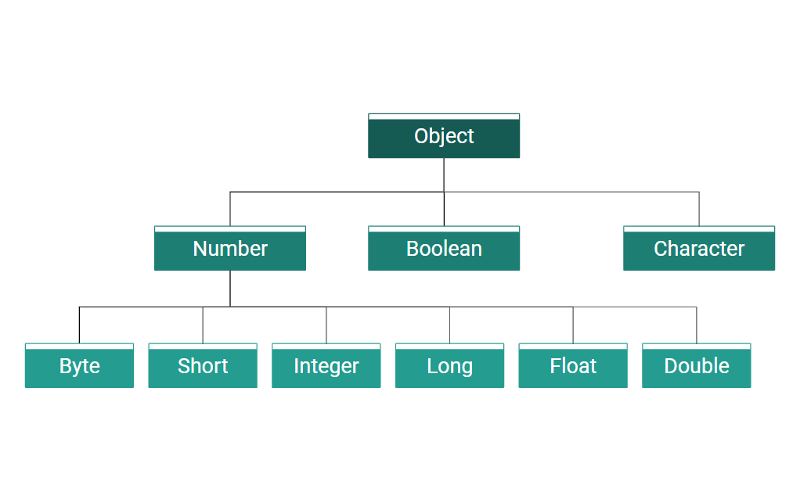

## Lớp Wrapper là gì? 
Lớp wrapper thực chất chỉ là cái tên chung cho rất nhiều lớp khác nhau. Trong Java có 8 kiểu dữ liệu nguyên thuỷ, nên cũng sẽ có 8 lớp wrapper cho từng kiểu nguyên thuỷ này, các lớp đều nằm trong package `java.lang`.     

***Sơ đồ thứ bậc các lớp wrapper***  

  


| Kiểu dữ liệu nguyên thuỷ | Lớp Wrapper tương ứng |   
| --- | --- | 
| byte | Byte | 
| short | Short | 
| int | Integer | 
| long | Long |
| float | Float | 
| double | Double | 
| char | Character | 
| boolean | Boolean |  

## Tác dụng của lớp Wrapper  
- Lớp Wrapper giúp chuyển kiểu dữ liệu qua lại giữa kiểu dữ liệu nguyên thuỷ và kiểu dữ liệu tham chiếu   

Ví dụ: 
```java
int age = 25;
Integer i = Integer.valueOf(age);
```
- Các lớp Wrapper được sử dụng để cung cấp cơ chế "bọc" hoặc ràng buộc các giá trị của kiểu dữ liệu nguyên thủy vào một đối tượng. Điều này giúp các kiểu nguyên thủy hoạt động tương tự như các đối tượng và thực hiện các hoạt động dành riêng cho các đối tượng.

- Chúng ta không thể cung cấp các giá trị null cho các kiểu dữ liệu nguyên thủy nhưng các lớp wrapper có thể là null. Vì vậy, các lớp wrapper có thể được sử dụng trong những trường hợp như vậy chúng ta sẽ cần gán giá trị null cho các kiểu dữ liệu nguyên thủy


## Boxing và Unboxing  
### Boxing và autoboxing
Boxing không phải là đấm bốc đâu nhé, đây có nghĩa là chuyển từ kiểu dữ liệu nguyên thuỷ sang Wrapper (Đóng hộp). Tuy nhiên cách này đã bị hạn chế sử dụng từ phiên bản Java 9, thay vào đó chúng ta có thể sử dụng autoboxing   

```java
//Boxing
int a = 500;
Integer i = new Integer(a); //Từ phiên bản Java 9 cách này đã bị hạn chế sử dụng
//Autoboxing
Integer j = a;
Float f = 4.5f;
Double d = 5d;
Character ch = 'a';
Boolean b = true;
```

### Unboxing  
Ngược lại với hai cách trên, khi bạn chuyển từ kiểu wrapper sang kiểu dữ liệu nguyên thuỷ, quá trình đó được gọi là unboxing (Mở (Đập) hộp, nghe như mấy youtuber hay đập hộp hàng hiệu ấy nhỉ)  
Bạn có thể thực hiện unboxing thông qua các phương thức `typeValue()`, với type là đại diện cho từng loại dữ liệu  
```java
//Unboxing
int i1 = i.intValue();
int j1 = j.intValue();
float f1 = f.floatValue();
double d1 = d.doubleValue();
char ch1 = ch.charValue();
boolean b1 = b.booleanValue();

//Hoặc chỉ cần
int i2 = i;
int j2 = j;
float f2 = f;
double d2 = d;
char ch2 = ch;
boolean b2 = b;
```

## Một số phương thức thường dùng của lớp wrapper

| Method | Description | 
| --- | --- |  
| `typeValue()` | Chuyển đổi một giá trị của lớp Wrapper nào đó về kiểu dữ liệu nguyên thủy |  
| `compareTo()` | So sánh hai giá trị của hai lớp Wrapper (có cùng kiểu dữ liệu) với nhau và trả về giá trị là số nguyên| 
| `equals()` | So sánh các giá trị của các lớp Wrapper và trả về một kiểu boollean |  
| `compare()` | Tương tự phương thức `compareTo()`, tuy nhiên nó là phương thức static | 
| `toString()` | Trả về là một chuỗi tương ứng với giá trị truyền vào |
| `parseType()` | Trả về giá trị nguyên thủy tương ứng với chuỗi truyền vào, Type tương ứng với kiểu dữ liệu |  