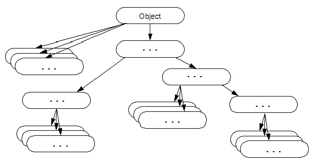

## Class Object

Lớp Object là một lớp được hệ thống tạo sẵn và hệ thống cũng chỉ định nó là lớp cha cao nhất của tất cả các lớp trong Java.  



Ví dụ: Khi ta khai báo một class:
```java
public class Person{
}
```

Ở đây bạn thấy class `Person` không kế thừa bất kỳ một class nào khác, và bạn nghĩ rằng nó là lớp cha cao nhất. Tuy nhiên, nếu như bạn không chỉ định lớp cha cho một lớp nào đó, thì hệ thống mặc định cho lớp đó kế thừa từ một lớp, chính là lớp Object. Và vì nó là mặc định được lớp khác kế thừa đến (trừ lớp đã khai báo kế thừa một lớp khác rồi, vì trong Java không hỗ trợ đa kế thừa), nên bạn không nhất thiết phải khai báo cho rõ ràng sự kế thừa đến lớp Object.  

## Tác dụng của lớp Object
- Bạn có thể sử dụng lớp Object để khai báo trước một đối tượng mà bạnh chưa biết kiểu dữ liệu của đối tượng đó. Về sau khi vào từng tình huống cụ thể, bạn sẽ ép kiểu lớp Object về lớp con tương ứng (sử dụng upcasting)
- Giúp gom các giá trị giống nhau của các lớp vào cũng một lớp cơ sở  

## Một số phương thức có trong lớp Object  

| Method | Description | 
| --- | --- | 
| `public final Class getClass()` | Trả về đối tượng lớp Class của đối tượng hiện tại. Lớp này chứa các thông tin được xây dựng liên quan đến đối tượng đang gọi | 
| `public int hashCode()` | Trả về số Hashcode cho đối tượng hiện tại | 
| `public boolean equals(Object obj)` | So sánh đối tượng hiện tại với đối tượng được chỉ định | 
| `protected Object clone() throws CloneNotSupportedException` | Tạo và trả về bản sao của đối tượng hiện tại | 
| `public String toString()` | Trả về chuỗi ký tự đại diện của đối tượng hiện tại | 
| `protected void finalize()throws Throwable` | Được gọi bởi Garbage Collector trước khi đối tượng bị dọn rác | 