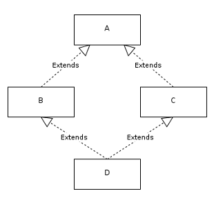

## Tại sao Java không hỗ trợ đa kế thừa?  
Đầu tiên, để chắc chắn rằng Java không hỗ trợ đa kế thừa thì đây là tuyên bố của **James Gosling** vào tháng 2/1995:  


## Diamond problem 

Đa kế thừa trong Java có thể dẫn tới **Diamond problem**    
**Diamond problem** (Dịch ra là vấn đề kim cương mà nghe củ chuối lắm nên dữ nguyên nhé :))), đây là một vấn đề phổ biến trong Java khi nói đến tính kế thừa. Hãy xem xét ví dụ dưới đây để hiểu rõ hơn về **Diamond problem**  

Giả sử trong class A có phương thức `foo()` và sau đó class B và class C cùng kế thừa từ class A và có phương thức `foo()` riêng của mỗi class.  

```java  
public abstract class A {
    public abstract void foo(String s);
}
```

```java
public class B extends A{
    @Override
    public void foo(String s) {
        System.out.println(s);
    }
}
```

```java
public class C extends A{
    @Override
    public void foo(String s) {
        System.out.println(s);
    }
}
```

Vấn đề bây giờ là mình có thêm class D, class này cũng lúc kế thừa cả B và C. Vậy class D sẽ sử dụng phương thức `foo()` của class B hay C? Vấn đề mơ hồ này chính là **Diamond problem**  

```java
public class D extends B,C{

}
```

         


## Làm thế nào để đạt được đa kế thừa trong Java  
Đơn giản thôi, chúng ta sẽ sử dụng interface. Một class không thể kế thừa từ nhiều class nhưng có thể implements nhiều interface khác nhau cùng một lúc  

Quay lại với ví dụ trên,ta sẽ giải quyết vấn đề bằng cách sử dụng các interface  

Tạo 2 interface như sau:  
```java
public interface InterfaceB {
    void foo(String s);
}

```

```java
public interface InterfaceC {
    void foo(String sS);
}
```

Class D sẽ implements cả 2 interface đó:  
```java
public class D implements InterfaceB, InterfaceC {
    @Override
    public void foo(String s) {
        System.out.println(s);
    }
}
```

```java
public class Main {
    public static void main(String[] args) {
        InterfaceB interfaceB = new D();
        interfaceB.foo("InterfaceB");
        
        InterfaceC interfaceC = new D();
        interfaceC.foo("InterfaceC");
    }
}
```

Ở đây ta thấy các interface `InterfaceB` và `InterfaceC` đều có chung hàm `void foo();` nhưng khi class D implements chúng thì chỉ có một hàm được triển khai. Đây chính là đặc điểm của interface, nó có khả năng thay đổi hành vi ở runtime. Và cũng là lý do tại sao chúng ta nên dùng interface để đạt được mục đích đa kế thừa