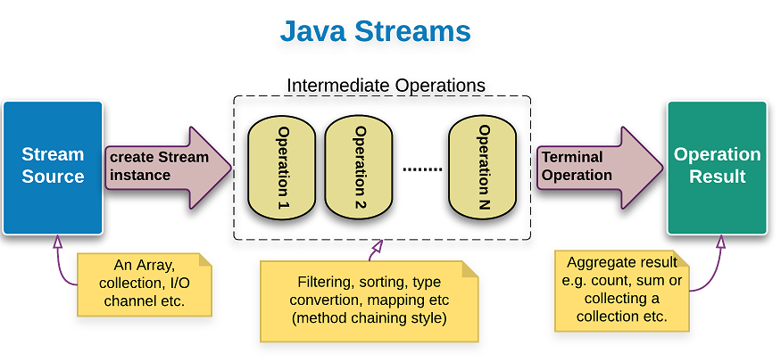

## Stream API là gì?
Stream là một trong những feature chính được thêm vào từ phiên bản Java 8, giúp cho việc thao tác trên collection và array trở nên dễ dàng và tối ưu hơn.  
 
Tất cả các class và interface của Stream API nằm trong package `java.util.stream`. Bằng cách sử dụng các stream, chúng ta có thể thực hiện các phép toán tổng hợp khác nhau trên dữ liệu được trả về từ các collection, array, các hoạt động input/ouput

Hầu hết các operation của stream đều có thể dùng lambda expression nên bạn có thể yên tâm sử dụng

## Cách Stream hoạt động  
Hãy xem ví dụ dưới đây:  

```java
List<Integer> list = 
    Arrays.asList(1,5,3,9,7,2,1,4);

list.stream()
    .filter(i -> i%2 == 0)
    .forEach(System.out::println);
```

Một Stream đại diện cho một collection được xử lý tuần tự và hỗ trợ rất nhiều operation để tính toán dựa trên những element của collection đó.  
Một stream operation có thể ở giữa hoặc ở cuối.   
Nếu nó là operation ở giữa, nó sẽ return một stream, nhờ vậy mà ta có thể thực hiện tính toán trên nhiều element ngay trong lúc này mà không cần bất cứ một dấu chấm phẩy nào.   
Một operation ở cuối nghĩa là nó không return một stream nào nữa hoặc trả về `void`.  
Trong ví dụ trên, `filter()` chính là operation giữa, còn `forEach()` là operation cuối.  

## Các loại Stream  
Collection interface được hỗ trợ 2 phương thức để tạo `Stream` bao gồm:  
- `stream()`: trra về một stream sẽ được xử lý tuần tự.  
- `parallelStream()`: Trả về một Stream song song, các xử lý sau đó sẽ được thực hiện song song  

## Các đặc điểm của Stream  
- Stream không phải là một cấu trúc dữ liệu để lưu trữ các phần tử. Thay vào đó nó sẽ mang các phần tử từ các cấu trúc dữ liệu khác như collection, array,... thông qua một luồng các hoạt động tính toán  
- Stream là immutable object, các hoạt động toongrr hợp mà chúng ta thực hiện trên collection, array hoặc bất kỳ dữ liệu nào khác không làm thay dổi dữ liệu của nguồn, chúng chỉ trả về stream mới
- Các hoạt động như liltering, mapping đều có thể implement lazily. Điều này sẽ có lợi cho việc tối ưu hóa  
- Các phần tử trong Stream chỉ được ghé thăm một lần trong vòng đời của Stream    
- Stream operators được chia thành `intermediate operations` và `terminal operations`  

## Quá trình thực thi của một Stream  

  

Một Stream sẽ trải qua 3 giai đoạn chính:  
1. Khởi tạo Stream  
2. Hoạt động trung gian - Intermediate Operations  
3. Hoạt động đầu cuối - Terminal operations  

## Tạo Stream
### Tạo empty stream  

Method `empty()` được sử dụng để tạo một empty stream  
```java
Stream<String> stream = Stream.empty();
``` 
Empty stream thường được sử dụng khi khởi tạo để tránh việc trả về null cho các stream không có phần tử nào  
```java
public Stream<String> streamOf(List<String> list) {
    return list == null || list.isEmpty() ? Stream.empty() : list.stream();
}
```

### Tạo Stream với kiểu dữ liệu nguyên thủy  

Stream chỉ làm việc với các Object, vì vậy để tạo Stream cho các kiểu dữ liệu nguyên thủy chúng ta cần phải sử dụng các Stream cụ thể cho từ kiểu dữ liệu như tương ứng với `int` thì có `IntStream`, `DoubleStream` cho `double`,... 

```java
IntStream intStream1 = IntStream.range(1,10);
IntStream intStream2 = IntStream.of(20,14,65,9,41);

DoubleStream doubleStream = DoubleStream.of(4.8, 6.5, 9.1, 23);
```

### Tạo Stream từ các collection  
Stream cũng có thể được tạo từ bất kỳ collection nào, chỉ đơn giản gọi phương thức `stream()`  
```java
List<Integer> list =
    Arrays.asList(1,5,3,9,7,2,1,4);
Stream<Integer> stream = list.stream();
```
Hoặc từ `Set`:

```java
Set<String> set = new HashSet<>();
set.add("Java");
set.add("Python");
set.add("C/C++");
set.add("Ruby");

Stream<String> stream = set.stream();
```

### Tạo Stream từ mảng  
Stream cũng có thể được tạo từ array hoặc một phần của array  
```java
String[] arr = new String[]{"Chó", "Mèo", "Gà", "Chuột"};
Stream<String> stream1 = Arrays.stream(arr);
Stream<String> stream2 = Arrays.stream(arr, 1,3);
```  

