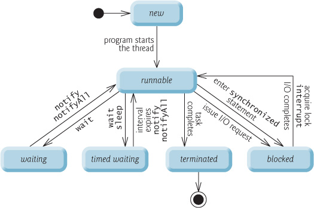

## Thread và Multi-thread
Thread (luồng) về cơ bản là môt tiến trình con (sub-process). Một đơn vị xử lý nhỏ nhất của máy tính có thể thực hiện một công việc riêng biệt. Trong java, các luồng được quản lý bởi JVM  

Multi-thread (đa luồng) là một tiến trình thực hiện nhiều luồng đồng thời. Một ứng dụng java, ngoài luông chính có thể có các luồng khác thực thi đồng thời làm ứng dụng chạy nhanh và hiệu quả hơn.  

Ví dụ: Khi play nhạc, chúng ta vẫn có thể tương tác được với nút điều khiển như: Play, pause, next, back … vì luồng phát nhạc là luồng riêng biệt với luồng tiếp nhận tương tác của người dùng.  

## Ưu điểm và nhược điểm của đa luồng
### Ưu điểm  
- Nó không chặn người sử dụng vì các luồng là độc lập và có thể thực hiện nhiều công việc cùng một lúc.  
- Có thể thực hiện nhiều hoạt động với nhau để tiết kiệm thời gian.  
- Luồng là độc lập vì vậy nó không ảnh hưởng đến luồng khác nếu ngoại lệ xảy ra trong một luồng duy nhất  

### Nhược điểm
- Càng nhiều luồng thì xử lý càng phức tạp.
- Xử lý vấn đề về tranh chấp bộ nhớ, đồng bộ dữ liệu khá phức tạp.
- Cần phát hiện tránh các luồng chết (dead lock), luồng chạy mà không làm gì trong ứng dụng cả.

## Vòng đời (Các trạng thái) của Thread  

Vòng đời của thread trong Java được kiểm soát bởi JVM. Java định nghĩa các trạng thái của luồng trong các thuộc tính static của lớp `Thread.State`  
- `NEW`: Đây là khi luồng vừa được khởi tạo bằng phương thức khởi tạo của lớp `Thread` nhưng chưa được `start()`. Ở trạng thái này, luồng được tạo nhưng chưa được cấp phát tài nguyên và cũng chưa chạy. Nếu luồng đang ở trạng thái này mà ta gọi phương thức ép buộc như stop, resume, suspend,... sẽ sảy ra ngoại lệ `IllegalThreadStateException`  
- `RUNNABLE`: Sau khi gọi phương thức `start()` thì luồng test đã được cấp phát tài nguyên và các lịch điều phối CPU cho luồng test cũng bắt đầu có hiệu lực. Ở đây, chúng ta dùng trạng thái Runnable chứ không phải running, vì luồng không thực sự luôn chạy mà tùy vào hệ thống mà có sự điều phối CPU khác nhau.  
- `BLOCKED`: Đây là một dạng của trạng thái `Not Runnable`. Thread chờ một đối tượng bị lock bởi JVM monitor  
- `WAITING`: Đây là một dạng của trạng thái `Not Runnable`. Thread đang chờ một notify từ một thread khác. Thread rơi vào trạng thái này do phương thức `wait()` hoặc `join()`  
- `TIMED.WAITING`: Đây là một dạng của trạng thái `Not Runnable`. Thread đang chờ notify từ một thread khác trong một thời gian nhất định, Thread rơi vào trạng thái này do phương thức `wait(long timeout)` hoặc `join(long timeout)`  
- `TERMINATED`: Thread đã hoàn thành công việc trong `run()` hoặc bị `stop()`

## Processes & threads
| | Process | Thread | 
| --- | --- | --- | 
|Khái niệm | Một chương trình đang chạy được gọi là Process | Một chương trình chạy có thể có nhiều Thread, cho phép chương trình đó chạy trên nhiều luồng một cách đồng thời. |  
| Không gian địa chỉ | Mỗi Process có một không gian địa chỉ riêng biệt | Tất cả Thread thuộc một Process chia sẻ không gian địa chỉ với nhau, chúng hợp lại thành một tiến trình | 
| Đa nhiệm | Đa nhiệm dựa trên process cho phép máy tính chạy từ 2 chương trình đồng thời trở lên | Đa nhiệm dựa trên thread cho phép chạy một chương trình có từ 2 luồng đồng thời trở lên | 
| Giao tiếp | Giao tiếp giữa hai tiến trình là tốn kém và bị giới hạn | Giao tiếp giữa 2 thread ít tốn kém hơn so với tiến trình | 
| Thành phần | Bao gồm: Không gian địa chỉ, biến global, xử lý tín hiệu, những tiến trình con, thông tin tính toán | Bao gồm: Thanh ghi, trạng thái, stack, bộ đếm chương trình | 
| Điều khiển | Đa nhiệm dựa trên process không thuộc quyền kiểm soát của Java | Đa nhiệm dựa trên thread phụ thuộc kiềm quyển soát Java | 
| Ví dụ | Khi chạy một ứng dụng Java thì đó được gọi là một tiến trình | Một ứng dụng đếm từ trong 1000 file, có sử dụng 4 luồng để chạy đồng thời |

