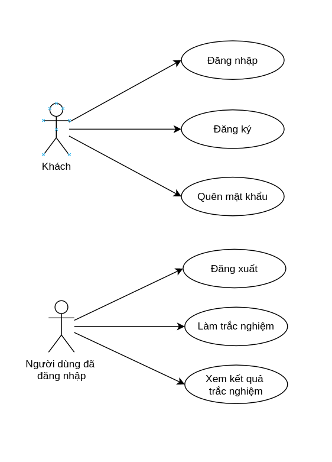
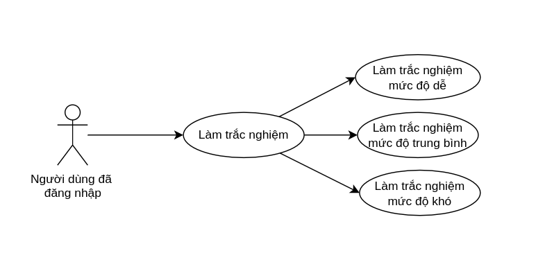
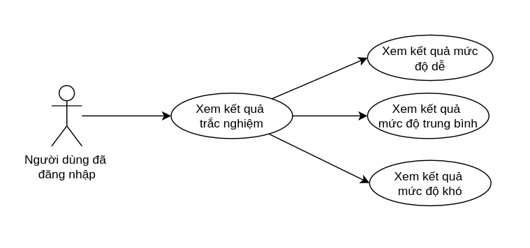
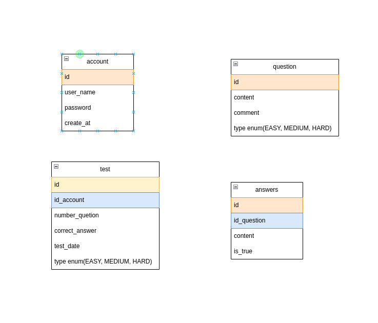

## Project: Xây dựng mini game quizz java đơn giản

### Kiến thức vận dụng
- Java OOP
- Exception
- Collection
- Kết nối với cơ sở dữ liệu MySQL sử dụng JDBC

### Phân tích thiết kế 

Hệ thống có 2 tác nhân: 
- Người dùng chưa đăng nhập
- Người dùng đã đăng nhập

**Biểu đồ use case:**

**Phân rã use case "Làm trắc nghiệm":**  

**Phân rã use case "Xem kết qủa trắc nghiệm":**  

### Thiết kế database

### Hướng dẫn cài đặt chương trình

1 Download file quizz.sql import vào database    

2 Trong chương trình java, tại thư mục database, class ConnectDatabase cập nhật lại HOST_NAME(nếu bạn dùng một host name hoặc port khác), cập nhạt lại PASSWORD là password đăng nhập vào MySQL của bạn

***Lưu ý:***
- Khi đăng ký tài khoản mới thì tên đăng nhập cần lớn hơn 5 ký tự và nhỏ hơn 20 ký tự, chưa tồn tài trong database

- Mật khẩu cần dài từ 8 tới 20 ký tự, cóp ít nhất 1 ký tự in hoa, 1 ký tự số và 1 ký tự đặc biệt